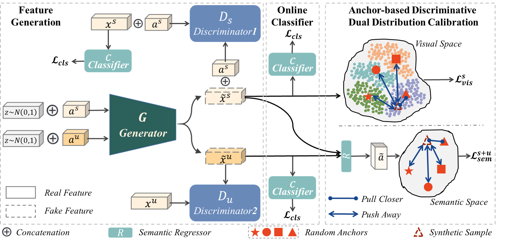

# AD3C-FGN

The implementation of "Anchor-based Discriminative Dual Distribution Calibration for Transductive Zero-Shot Learning" on Pytorch

### Model Architecture

*AD3C-FGN Architecture Figure from the Paper*

### Dependencies

- Python 3.8, PyTroch 1.13
- sklearn, scipy, numpy, tqdm

### Prepare dataset

Firstly, download datasets from https://drive.google.com/drive/folders/141SC24gysjpeXmX8m-VKZFeyJca93I03?usp=drive_link, then edit the 'data_root' and 'dataset' in run.sh to point to your dataset location.

### Training
- After training, models will be saved to defined path in `./models`.
- Training process without any pretrained models.
    - `sh run.sh`

### Evaluation
- Edit 'G_model_path' and 'C_model_path' in test.sh to point to the location of the saved generator and online classifier models, then use the loaded models for evaluation
    - `sh test.sh`